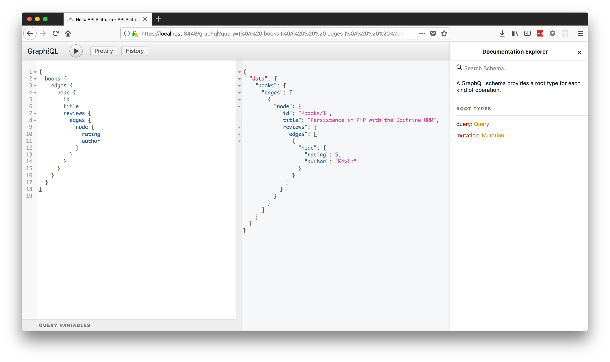

# 开始使用 API Platform: 提供Hypermedia ,GraphQL API, Admin 以及 Progressive Web App的支持


> 在任何框架或语言中,API Platform最先进的API构建平台
>
> - Fabien Potencier (Symfony框架创始人), SymfonyCon 2017

[API Platform](https://api-platform.com/)是一个强大但易于使用的,专用于构建API驱动项目的全栈型框架。它包含一个PHP库，用于创建支持行业领先标准的全功能API (JSON-LD, GraphQL, OpenAPI...), 提供雄心勃勃的JavaScript工具，以便任何客户端都可以快速使用这些API (admin, PWA 和 移动应用生成器, hypermedia客户端...) 并且它整合了 **Docker** and **Kubernetes** 用于快速开发以及云端部署.

最快速，简单使用的入门方法是下载API-Platform的官方发行版。它包含：

* 一个API骨架(基于symfony skeleton), 包含了 [核心服务端组件](https://api-platform.com/docs/core/index/), [Symfony4微框架](https://symfony.com/doc/current/setup/flex.html) 以及[Doctrine ORM](http://docs.doctrine-project.org/projects/doctrine-orm/)
* 一个基于[React](https://reactjs.org/) 和 [React Admin](https://marmelab.com/react-admin/)开发的利用的API Platform的` hypermedia`(注:即返回结果中提供链接，连向其他API方法，使得用户不查文档，也知道下一步应该做什么)功能的管理面板https://marmelab.com/react-admin/)
* 一个PWA框架，使用 [Create React App](https://github.com/facebookincubator/create-react-app)生成并且使用包含一个一条命令即可构建你自己的 React/[Redux](https://redux.js.org/) app的工具
* 一个 [Docker](https://docker.com)工具-配置好后就可在一个命令中启动项目, 提供以下服务:
  * 用于运行 API 和 JavaScript 客户端应用的服务器
  * 一个 [Varnish Cache](http://varnish-cache.org/) 服务器,用于开启 [API Platform的内置清除缓存机制](../core/performance.md#enabling-the-builtin-http-cache-invalidation-system)
  * 一个开发环境下的 HTTP/2 及 HTTPS 代理 (比如, 允许测试 [service workers](https://developer.mozilla.org/fr/docs/Web/API/Service_Worker_API)提供者)
  * 一个可以在任何[Kubernetes](https://kubernetes.io/)环境下部署API的 [Helm](https://helm.sh/)图表

为了了解框架的工作原理，我们将创建一个书店管理应用的API示例来管理图书。

要创建功能齐全的API，管理界面以及PWA应用，我们只需要设计API的公共数据模型(Symfony以及Doctrine中称为实体-Entity)并手动编写这模型类.

API-Platform使用这些模型类来暴露具有以下功能的Web API:

* 创建，检索，更新和删除（CRUD）资源
* 数据验证
* 分页
* 过滤
* 排序
* hypermedia/[HATEOAS](https://en.wikipedia.org/wiki/HATEOAS) 内容协调支持 ([JSON-LD](http://json-ld.org),[HAL](http://blog.stateless.co/post/13296666138/json-linking-with-hal), [JSON API](http://jsonapi.org/))
* [支持GraphQL](http://graphql.org/)
* 漂亮的UI以及机器可读的文档 ([Swagger/OpenAPI](https://swagger.io), [Hydra](http://hydra-cg.com))
* 认证 ([Basic HTTP](https://en.wikipedia.org/wiki/Basic_access_authentication), cookies 以及通过扩展实现的 [JWT](https://jwt.io/)和 [OAuth](https://oauth.net/))
* 支持跨域访问的[CORS headers](https://developer.mozilla.org/en-US/docs/Web/HTTP/Access_control_CORS)
* 安全检查和headers (针对 [OWASP recommendations](https://www.owasp.org/index.php/REST_Security_Cheat_Sheet)的测试)
* invalidation-based模式HTTP的缓存
* 基本上实现了构建现代API所需的一切

还有一件事，在我们开始之前必须说明:  由于API Platform发行包包含了 [ Symfony框架](https://symfony.com),所以它可以使用大多数的 [Symfony bundles](https://symfony.com/blog/the-30-most-useful-symfony-bundles-and-making-them-even-better)(Symfony扩展包) ,并从这个Symfony这个坚如磐石的基础上（包含事件驱动，依赖注入等web开发所需的一切）获益。由于以上原因，使API Platform开发自定义功能,面向服务开发, API端点, JWT或OAuth身份验证, HTTP缓存，邮件发送或异步作业等功能非常简单

## 安装框架

### 使用离线发行包 (建议)

首先[下载API Platform发行版的压缩包](https://github.com/api-platform/api-platform/releases/latest) 并解压。生成的目录包含一个空的API Platform项目结构。您将在其中添加自己的代码和配置.

API Platform 自带了一个 [Docker](https://docker.com) 配置, 可以轻松的启动一个开发环境.如果你的电脑上还没有安装Docker, [那么现在是时候安装它了](https://docs.docker.com/install/).

在MacOS系统下, 只要安装 [Docker for Mac](https://docs.docker.com/docker-for-mac/) 就可以了.
同样的, 在Windows系统下, 只要 [Docker for Windows](https://docs.docker.com/docker-for-windows/) 就行. Docker Machine不支持开箱即用.

打开终端，然后导航到包含项目框架的目录。运行以下命令以使用[Docker Compose](https://docs.docker.com/compose/)启动所有服务:

    $ docker-compose pull # Download the latest versions of the pre-built images
    $ docker-compose up -d # Running in detached mode

这将启动以下服务:

| 服务名        | 描述                                                   | 端口(s) | 环境(s)
| ----------- | ------------------------------------------------------------- | ------- | --------------
| php         | PHP，PHP-FPM 7.2，Composer以及敏感配置的API | n/a     | all
| db          | PostgreSQL数据库服务                           | 5432    | all (在生产环境下也可以使用外置数据库)
| client      | PWA的开发环境服务          | 80      | dev (在生产环境下请使用专门的静态网站托管服务)
| admin       | 管理面板的开发环境服务                         | 81      | dev (在生产环境下请使用专门的静态网站托管服务)
| api         | API的HTTP服务 (Nginx)                           | 8080    | all
| cache-proxy | 由Varnish提供的HTTP缓存代理            | 8081    | all (在生产环境下也可以使用外置数据库)
| h2-proxy    | 所有应用的 HTTP/2 和 HTTPS 代理            | 443 (client)<br>444 (admin)<br>8443 (api)<br>8444 (cache-proxy) | dev (在prod中正确配置您的Web服务器)

要查看容器的日志，请运行:

    $ docker-compose logs -f # follow the logs

发行版已经为您配置好的[Docker volume](https://docs.docker.com/engine/tutorials/dockervolumes/)文件映射，项目的文件在本地主机和容器之间自动共享。这意味着您可以使用任何的IDE或代码编辑器在本地编辑项目的文件，它们将在容器中共享代码。谈到IDE，最适合用于开发API Platform应用的软件应该是[PHPStorm](https://www.jetbrains.com/phpstorm/)及其出色的[Symfony](https://confluence.jetbrains.com/display/PhpStorm/Getting+Started+-+Symfony+Development+using+PhpStorm)和[Php Inspections](https://plugins.jetbrains.com/plugin/7622-php-inspections-ea-extended-)插件。尝试一下，许多编码工作与质量分析可以通过它们自动完成。

API Platform发行版带有一个用于测试的模型: `api/src/Entity/Greeting.php`. 我们稍后将会删除它.

如果你对PHP的生态比较熟悉，你可能会猜到这个测试用的实体使用业界领先的[Doctrine ORM](http://www.doctrine-project.org/projects/orm.html)库作为持久性系统。它在API Platform发行版中已经包含。 Doctrine ORM是在API Platfrom项目中持久化和查询数据的最简单方法，这要归功于发行版附带的桥接器。它针对性能和开发方便性进行了优化。例如，在使用Doctrine时，API Platform可以通过添加适当的JOIN子句来自动优化生成的SQL查询。它还提供了许多强大的内置过滤器。 Doctrine ORM及其桥接器支持最流行的RDBMS数据库服务，包括PostgreSQL，MySQL，MariaDB，SQL Server，Oracle和SQLite。

### 使用 Symfony Flex and Composer构建 (高级用户)

> 译者建议刚开始学习,使用此方法安装,以便于深入了解Symfony的开发机制

或者，API Platform作为Composer包也可以直接安装在本地计算机上。建议仅对希望完全控制目录结构和已安装依赖项的高级用户使用此方法。

本教程的其余部分假设您已使用官方发行版安装了API Platform，如果是这样，可以略过此处,直接进入下一部分。

API Platform一个由Symfony官方支持的Symfony Flex recipe. 这意味着您可以通过Composer从任何包含Flex-compatible的Symfony应用程序轻松安装它:

> 译者注: 其实只要创建一个symfony4项目并且用composer来下载api platform的flex recipe即可

    # 创建一个新的Symfony4项目(使用微框架创建)
    $ composer create-project symfony/skeleton bookshop-api
    # 进入项目目录
    $ cd bookshop-api
    # 在skeleton骨架中安装API Platform
    $ composer req api

然后, 创建数据库及表结构:

    $ bin/console doctrine:database:create
    $ bin/console doctrine:schema:create

> 译者注:建议不要下面的bin/console doctrine:schema:create创建表结构,这是SF2的旧方法.最新方法如下

```shell
bin/console doctrine:database:create
# 创建一个模型
bin/console make:entity
# 创建数据库迁移
bin/console make:migration
# 根据迁移生成数据表结构
bin/console doctrine:migrations:migrate
```

接下来使用内置的PHP服务器或Symfony WebServerBundle启动应用:

    # Built-in PHP server
    $ php -S 127.0.0.1:8000 -t public
    
    # Symfony WebServerBundle
    $ composer req server --dev
    $ bin/console server:run

与Docker配置的发行包发行包不同的是,使用此方法安装的API Platform只包含PHP组件,而所有[JavaScript组件](https://github.com/api-platform?language=javascript)(例如:管理员面板)可使用NPM或Yarn独立安装(例如:克隆管理员面板后部署到Github.io或者七牛云又或者Nignx中访问)。

**注意:** 使用此方法安装后, 所有的API都暴露在 `/api/` 这个路径之下. 比如项目的HTTP访问地址是`http://server.phpna.test`,那么API文档的访问地址为 `http://server.phpna.test/api/` .Ningx或者Apache的配置规则与Symfony的配置规则相同,具体请查看[Symfony服务器配置规则](https://symfony.com/doc/current/setup/web_server_configuration.html).

## 准备好了!

> 本地安装无欢迎页面并且无需https,查看API列表以及操作前缀均为`http://{your-project-nginx-server-name}/api/`

在浏览器中打开 `https://localhost`:


您需要在浏览器中添加安全例外，以接受在安装框架时为此容器生成的自签名TLS证书。对通过HTTPS提供的所有其他服务重复此步骤。 稍后您可能会在PWA(Progressive Web App)的主页上替换此欢迎屏幕。如果您不打算创建PWA，可以删除docker-compose.yaml中的`client/`目录和相关行（现在不要这样做，因为我们将在本教程后面使用此容器）。 单击“HTTPS API”按钮，或转到`https:// localhost:8443 /`：


API Platform以[OpenAPI](https://www.openapis.org/)格式（以前称为Swagger）公开API的描述。它还集成了一个 [Swagger UI](https://swagger.io/swagger-ui/)的定制版本，这是一个用于呈现Open API文档的非常友好的界面。单击**横向箭头**以显示每个API的详细信息。您还可以直接从UI发送API请求。尝试使用`POST`操作创建新的Greeting资源，然后使用`GET`操作访问它，最后通过执行`DELETE`操作将其删除。如果您使用Web浏览器访问任何API URL，API Platform会检测它（通过扫描`Accept` HTTP标头）并在UI中显示相应的API请求。现在尝试浏览`http:// localhost:8080/greetings`(如果是本地项目则地址为`http://{your-project-nginx-server-name}/api/greetings`)。如果Accept标头不包含text/html作为首选格式，则发送JSON-LD响应（查看[可配置行为](../core/content-negotiation.md)）。

因此,如果需要访问原始数据,您有两种选择:

* 添加正确的`Accept`标头（或者如果您不关心安全性，则根本不设置任何``Accept`标头） - 编写API客户端时的首选方式
* 添加所需的格式作为资源的扩展 - 仅用于调试目的

在这个示例中,转`http:// localhost:8080/greetings.jsonld`以检索JSON-LD中的`Greeting`资源列表，或者访问`http:// localhost:8080/greetings.json`以检索原始JSON中的数据。 当然，您也可以使用自己喜欢的HTTP客户端来查询API。我们推荐[Postman](https://www.getpostman.com/)。它与API平台完美配合，具有原生Open API支持，可轻松编写功能测试并具有良好的团队协作功能。

> 译者注: 除了Postman之外[insomina](https://insomnia.rest/)也是个不错的选择

## 创建自定义模型

您的API Platform项目现在已经100％正常运行。让我们创建自己的数据模型。我们的书店API将以简单的方式开始。它将由`Book`(书本)模型和``Review`(评论)模型组成。

书籍具有id,ISBN(书号),title(标题),description(描述),author(作者),publicationDate(出版日期)等字段,并与评论模型设置成一对多的关联。

评论有id,打分rating(0到5之间),body(内容),author(作者),publicationDate(发表日期),并与书籍模型设置成多对一的关联.

让我们将这些数据模型描述为Plain Old PHP Objects(POPO),并使用Doctrine ORM annotations方式实现,最后注入数据库生成表结构:

```php
<?php
// api/src/Entity/Book.php

namespace App\Entity;

use Doctrine\Common\Collections\ArrayCollection;
use Doctrine\ORM\Mapping as ORM;

/**
 * A book.
 *
 * @ORM\Entity
 */
class Book
{
    /**
     * @var int The id of this book.
     *
     * @ORM\Id
     * @ORM\GeneratedValue
     * @ORM\Column(type="integer")
     */
    private $id;

    /**
     * @var string|null The ISBN of this book (or null if doesn't have one).
     *
     * @ORM\Column(nullable=true)
     */
    public $isbn;

    /**
     * @var string The title of this book.
     *
     * @ORM\Column
     */
    public $title;

    /**
     * @var string The description of this book.
     *
     * @ORM\Column(type="text")
     */
    public $description;

    /**
     * @var string The author of this book.
     *
     * @ORM\Column
     */
    public $author;

    /**
     * @var \DateTimeInterface The publication date of this book.
     *
     * @ORM\Column(type="datetime")
     */
    public $publicationDate;

    /**
     * @var Review[] Available reviews for this book.
     *
     * @ORM\OneToMany(targetEntity="Review", mappedBy="book")
     */
    public $reviews;
    
    public function __construct()
    {
        $this->reviews = new ArrayCollection();
    }

    public function getId(): ?int
    {
        return $this->id;
    }
}
```

```php
<?php
// api/src/Entity/Review.php

namespace App\Entity;

use Doctrine\ORM\Mapping as ORM;

/**
 * A review of a book.
 *
 * @ORM\Entity
 */
class Review
{
    /**
     * @var int The id of this review.
     *
     * @ORM\Id
     * @ORM\GeneratedValue
     * @ORM\Column(type="integer")
     */
    private $id;

    /**
     * @var int The rating of this review (between 0 and 5).
     *
     * @ORM\Column(type="smallint")
     */
    public $rating;

    /**
     * @var string the body of the review.
     *
     * @ORM\Column(type="text")
     */
    public $body;

    /**
     * @var string The author of the review.
     *
     * @ORM\Column
     */
    public $author;

    /**
     * @var \DateTimeInterface The date of publication of this review.
     *
     * @ORM\Column(type="datetime_immutable")
     */
    public $publicationDate;

    /**
     * @var Book The book this review is about.
     *
     * @ORM\ManyToOne(targetEntity="Book", inversedBy="reviews")
     */
    public $book;

    public function getId(): ?int
    {
        return $this->id;
    }
}
```

正如您所看到的,有两个典型的PHP对象与相应的PHPDoc(请注意,PHPDoc中包含的模型和属性的描述将出现在API文档中). Doctrine的annotations将这些实体映射到数据库中的表.

annotations很方便，因为它们允许对代码和配置进行分组,但是,如果想要要将模型类与元数据分离,则可以使用到XML或YAML方式描述,在Doctrine中它们也有着非常好的支持.

想要查看更多关于Entity实体模型的知识请查阅 [Doctrine官方文档](http://docs.doctrine-project.org/projects/doctrine-orm/en/latest/reference/association-mapping.html).

为简单起见，在本例中我们对模型内所有属性使用了public(id除外),以便于API文档能直接访问. API平台以及Doctrine也支持访问器方法(getter/setter),在模型中尽量使用私有属性生成访问器方法来访问而不是公共属性-public!我们使用id的私有属性和id的getter来强制它是只读的(由于`@ORM \GeneratedValue`注释,ID将由RDMS生成). API Platform也对UUID提供一级支持，您应该使用[它们](https://www.clever-cloud.com/blog/engineering/2015/05/20/why-auto-increment-is-a-terrible-idea/)而不是自动递增的ID.

现在,删除 `api/src/Entity/Greeting.php`, 这个演示模型已经没有任何用处了.
~~最后, 告诉Doctrine将数据库的表结构与我们的新的实体模型同步~~:

    $ docker-compose exec php bin/console doctrine:schema:update --force

> 以上方法在doctrine3中不建议使用,请看下文

`php`容器是您的API应用所在的位置。主机通过`docker-compose exec php`在容器内执行PHP命令。您也创建[别名](http://www.linfo.org/alias.html)简化命令。

> Doctrine3请使用[Doctrine Migrations](https://symfony.com/doc/current/doctrine.html#migrations-creating-the-database-tables-schema)方式更新数据结构

```shell
docker-compose exec php bin/console make:migration # 通过自动判断用于生成新项目的迁移以及更新迁移,推荐此命令
# 或者
docker-compose exec php bin/console doctrine:migrations:diff # 只用于更新迁移
# 最后根据迁移生成数据结构
docker-compose exec php bin/console doctrine:migrations:migrate
```

我们现在有一个可以持久化和查询的实体模型。要使用与实体类相对应的CRUD功能创建API，我们只需使用名为`@ApiResource`的annotaion来标记它:

```php
<?php
// api/src/Entity/Book.php

namespace App\Entity;

use ApiPlatform\Core\Annotation\ApiResource;

/**
 * ...
 *
 * @ApiResource
 */
class Book
{
    // ...
}
```

```php
<?php
// api/src/Entity/Review.php

namespace App\Entity;

use ApiPlatform\Core\Annotation\ApiResource;

/**
 * ...
 *
 * @ApiResource
 */
class Review
{
    // ...
}
```

**我们的API(差不多)准备好了！**浏览`https:// localhost:8443`以加载开发环境([包括好用的Symfony探查器](https://symfony.com/blog/new-in-symfony-2-8-redesigned-profiler)).

> 非Docker的本地开发环境浏览http://{your-project-nginx-server-name}/api


我们的2种模型资源类型可用的操作显示在UI中.

打开`Book`资源类型的`POST`操作,点击 "Try it out"然后发送以下请求内容:

```json
{
  "isbn": "9781782164104",
  "title": "Persistence in PHP with the Doctrine ORM",
  "description": "This book is designed for PHP developers and architects who want to modernize their skills through better understanding of Persistence and ORM.",
  "author": "Kévin Dunglas",
  "publicationDate": "2013-12-01"
}
```

您刚刚通过bookshop API保存了一本新书的数据! API Platform自动将JSON文档转换为相应PHP模型类的实例，并使用Doctrine ORM将其持久保存在数据库中。

默认情况下，API支持`GET`(查询数据以及数据集合),POST(创建),PUT(更新)和DELETE(删除)几个HTTP方法.除了这几个内置方法,您还可以[添加新的自定义操作](../core/operations.md#creating-custom-operations-and-controllers)(PATCH操作,子资源...)或[禁用您不想要的方法](../core/operations.md#enabling-and-disabling-operations).

尝试对数据集合进行`GET`操作。我们添加的新书出现了.当集合包含超过30个项目时,分页将自动显示,[这是完全可配置的](../core/pagination.md)。如果您想添加一些过滤器或者为集合添加排序,请查看[这个文档](../core/filters.md)。

您可能已经注意到某些键生成的JSON响应中是以`@`符号开头的(`@id`,`@type`,`@context` ...),这是什么情况?这说明API Platform完全支持[JSON-LD](http://json-ld.org/) 格式(及其[Hydra](http://www.hydra-cg.com/)扩展)的.它允许构建具有自动发现功能的智能客户端,就像我们在API Platform Admin中实现的几行代码一样。它对于开放数据，搜索引擎优化和互操作性非常有用，特别是与[Schema.org](http://blog.schema.org/2013/06/schemaorg-and-json-ld.html)等开放词汇表一起使用时，允许使用[Google访问结构化数据](https://developers.google.com/search/docs/guides/intro-structured-data)或使用[Apache Jena](https://jena.apache.org/documentation/io/#formats)在[SPARQL](https://en.wikipedia.org/wiki/SPARQL)中查询API。

我们认为JSON-LD是新API的最佳默认格式。但是，API Platform本身支持许多[其他格式](../core/content-negotiation.md)，包括[GraphQL](http://graphql.org/)(我们将它),[JSON API](http://jsonapi.org/),[HAL](http://stateless.co/hal_specification.html),原始[JSON](http://www.json.org/),[XML](https://www.w3.org/XML/)(实验性)甚至[YAML](http://yaml.org/)和[CSV](https://en.wikipedia.org/wiki/Comma-separated_values)。您还可以轻松添加对其他格式的支持,您也可以选择启用和默认使用的格式。

现在,我们使用`POST`操作给这本`BOOK`(图书)添加一条`Review`(评论):

```json
{
    "book": "/books/1",
    "rating": 5,
    "body": "Interesting book!",
    "author": "Kévin",
    "publicationDate": "September 21, 2016"
}
```

关于此请求,有两件有趣的事情需要提及:

 首先，我们学会了如何处理数据表关联的关系。在hypermedia API中，每条数据都有一个(unique) [IRI](https://en.wikipedia.org/wiki/Internationalized_Resource_Identifier)类型的ID。 一个URL是一个供API Platform使用的通过验证的IRI。每个JSON-LD文档的`@id`属性都包含标识它的IRI。您可以使用此IRI从其他文档中引用此文档。在之前的请求中，我们使用我们之前创建的Book的IRI将其与我们创建的Review相关联。 API Platform非常智能，可以处理IRI。顺便说一句，您可能希望[嵌入文档](../core/serialization.md) 而不是引用它们（例如，减少HTTP请求的数量）。您甚至可以[让客户端只选择它需要的属性](../core/filters.md#property-filter)。

另一个有趣的事情是API Platform如何处理日期（`publicationDate`属性）。 API Platform可以解析[PHP支持的任何日期格式](http://php.net/manual/en/datetime.formats.date.php).。在生成环境下，我们强烈建议使用[RFC 3339](http://tools.ietf.org/html/rfc3339),指定的格式，但正如您所看到的，可以使用包括 `September 21, 2016`在内的大多数常见格式。

总而言之，如果您想在调用任何您编写的实体模型:

1. 把`Entity`放在`src/Entity`目录下面
2. 如果您使用Doctrine,请把实体映射到数据库
3. 在实体中注入 `@ApiPlatform\Core\Annotation\ApiResource` annotation

这一切怎么会更容易,不可思议？！

## 数据验证

现在尝试通过向以下body向`/books`这个api发出`POST`请求来添加另一本新书：

```json
{
  "isbn": "2815840053",
  "description": "Hello",
  "author": "Me",
  "publicationDate": "today"
}
```

额，我们错过了添加标题。无论怎么提交请求，您都应该收到500错误，并显示以下消息：

    An exception occurred while executing 'INSERT INTO book [...] VALUES [...]' with params [...]:
    SQLSTATE[23000]: Integrity constraint violation: 1048 Column 'title' cannot be null

您是否注意到错误是在JSON-LD中自动序列化并且错误完全遵循Hydra Core词汇表？它允许客户端轻松从错误中提取有用信息。无论如何，在提交请求时收到SQL错误是不好的。这意味着我们没有使用有效的输入，这是并[不符合最佳实践](https://www.owasp.org/index.php/Input_Validation_Cheat_Sheet)。

API Platform自带[Symfony Validator组件](http://symfony.com/doc/current/validation.html)的桥接器。向我们的实体添加一些[验证规则](http://symfony.com/doc/current/validation.html#supported-constraints)(或[创建自定义规则](http://symfony.com/doc/current/validation/custom_constraint.html))足以验证用户提交的数据。让我们为数据模型添加一些验证规则：

```php
<?php
// api/src/Entity/Book.php

namespace App\Entity;

use Symfony\Component\Validator\Constraints as Assert;

// ...
class Book
{
    /**
     * ...
     * @Assert\Isbn
     */
    public $isbn;

    /**
     * ...
     * @Assert\NotBlank
     */
    public $title;

    /**
     * ...
     * @Assert\NotBlank
     */
    public $description;

    /**
     * ...
     * @Assert\NotBlank
     */
    public $author;

    /**
     * ...
     * @Assert\NotNull
     */
    public $publicationDate;

    // ...
}
```

```php
<?php
// api/src/Entity/Review.php

namespace App\Entity;

use Symfony\Component\Validator\Constraints as Assert;

// ...
class Review
{
    /**
     * ...
     * @Assert\Range(min=0, max=5)
     */
    public $rating;

    /**
     * ...
     * @Assert\NotBlank
     */
    public $body;

    /**
     * ...
     * @Assert\NotBlank
     */
    public $author;

    /**
     * ...
     * @Assert\NotNull
     */
    public $publicationDate;

    /**
     * ...
     * @Assert\NotNull
     */
    public $book;

    // ...
}
```

After updating the entities by adding those `@Assert\*` annotations (as for Doctrine, you can also use XML or YAML), try
again the previous `POST` request.

```json
{
  "@context": "/contexts/ConstraintViolationList",
  "@type": "ConstraintViolationList",
  "hydra:title": "An error occurred",
  "hydra:description": "isbn: This value is neither a valid ISBN-10 nor a valid ISBN-13.\ntitle: This value should not be blank.",
  "violations": [
    {
      "propertyPath": "isbn",
      "message": "This value is neither a valid ISBN-10 nor a valid ISBN-13."
    },
    {
      "propertyPath": "title",
      "message": "This value should not be blank."
    }
  ]
}
```

您现在可以获得正确的验证错误消息，并且这些信息始终会使用Hydra错误格式进行序列化(也支持[RFC 7807](https://tools.ietf.org/html/rfc7807))。这些错误很容易被客户端解析。通过通过添加适当的验证规则，我们还会注意到提供的ISBN无效...

## 添加GraphQL支持

API Platform不是REST和GraphQL框架吗？确实如此！默认情况下不启用对GraphQL的支持，添加它我们需要安装[graphql-php](https://webonyx.github.io/graphql-php/)库。运行以下命令（缓存需要清除两次）：

```bash
docker-compose exec php composer req webonyx/graphql-php && docker-compose exec php bin/console cache:clear
```

你现在有了GraphQL API！打开`https:// localhost:8443/graphql`你会看到一个API Platform附带的漂亮的[GraphiQL UI](https://github.com/graphql/graphiql)：



GraphQL实现支持[queries](http://graphql.org/learn/queries/)，[mutations](http://graphql.org/learn/queries/)，100％的[graphql-server-specification](https://facebook.github.io/relay/docs/en/graphql-server-specification.html)，分页，[filters](../core/filters.md)和[访问控制规则](../core/security.md)。您可以将它与流行的[RelayJS](https://facebook.github.io/relay/)和[Apollo客户端](https://www.apollographql.com/docs/react/)一起使用。

## 管理面板

通过一个管理面板管理公开的API数据不是很好吗？等等......你已经有了!在浏览器中打开`https:// localhost:444`：

> 译者注: 如果是本地安装的API Platform请直接克隆管理面板,配置好api地址,通过npm安装类库编译后运行即可


这个[Material Design](https://material.io/guidelines/) 管理面板是使用[API Platform Admin](../admin/index.md) (采用React Admin，React和Redux开发)构建的[PWA](https://developers.google.com/web/progressive-web-apps/)客户端。它功能强大且可完全自定义，请参阅其文档以了解更多信息。它利用API组件公开的Hydra API文档来构建自己。它是100％动态的，不会产生代码。

## 一个React/Redux Progressive Web App(PWA)

API平台还有一个非常棒的[客户端生成器](../client-generator/index.md) ，用于生产React/Redux和[Vue.js](https://vuejs.org/)的PWA应用，您可以轻松地进行调整和自定义。如果您希望利用移动设备的所有功能，则生成器还支持[React Native](https://facebook.github.io/react-native/) 。

发行包自带一个初始化应用生成器用于生产React风格代码的应用。要引导您的应用，请运行：

    $ docker-compose exec client generate-api-platform-client

打开`client/src/index.js`并按照控制台中显示的 复制/粘贴 说明进行操作。然后在浏览器中打开`https://localhost/books/`：


您还可以选择使用`--resource`参数生成特定资源的代码（例如：`generate-api-platform-client --resource books`）。 

生成的代码包含数据列表（包括分页），删除按钮，创建和编辑表单。它还包括[Bootstrap 4](http://getbootstrap.com) 标记和[ARIA](https://developer.mozilla.org/en-US/docs/Web/Accessibility/ARIA)角色，以使应用程序可供残障人士使用。 如果您希望生成基于Vue.js或本机移动应用程序构建的PWA，请[阅读专用文档](../client-generator/index.md)。

## 其他特性

首先，您可能希望了解如何使用[内置的Kubernetes集成](../deployment/kubernetes.md)在云端[部署您的应用程序](../deployment/index.md) 。

关于以上内容的细节还有更多需要学习！[阅读完整文档](../core/index.md)以了解如何使用它们以及如何扩展API Platform以满足您的需求。 API Platform对于原型设计和快速应用程序开发（RAD）非常有效。但该框架主要用于创建复杂的API驱动项目，远远超出简单的CRUD应用程序。这受益于它**强大的扩展点**，并且**不断优化性能**。它为众多高流量网站提供支持。

API Platform具有内置的HTTP缓存清理系统，可以使API Platform应用程序快速启动，默认情况下使用[Varnish](https://varnish-cache.org/)。阅读[API Platform核心库: 启用内置HTTP缓存清理系统](../core/performance.md#enabling-the-builtin-http-cache-invalidation-system)获得更多信息。 API Platfrom也可以使用PHP库和Symfony包进行扩展。

以下几个是常用API Platform的扩展：

* [JWT认证](https://github.com/lexik/LexikJWTAuthenticationBundle) (LexikJwtAuthenticationBundle) 或者 [OAuth](https://github.com/FriendsOfSymfony/FOSOAuthServerBundle)
  (FosOAuthServer)
* [发送邮件](https://symfony.com/doc/current/cookbook/email/email.html) (Swift Mailer)
* [使用RabbitMQ执行异步任务并创建微服务架构](https://github.com/php-amqplib/RabbitMqBundle)
  (RabbitMQBundle)

请记住，您可以使用自己喜欢的客户端技术：API Platform提供React和Vue.js组件;但您可以使用你喜欢的客户端技术，包括Angular，Ionic和Swift。任何能够发送HTTP请求的语言都可以（即使COBOL可以这样做）。

为了更进一步，API平台团队维护一个演示应用程序，显示更多高级用例，例如利用序列化组，用户管理或JWT和OAuth身份验证。可以[在GitHub上查看demo源代码](https://github.com/api-platform/demo)并[在线浏览](https://demo.api-platform.com)。